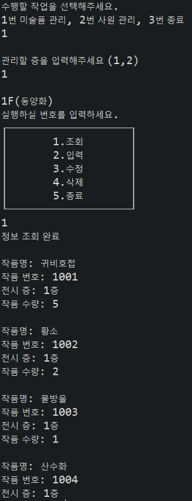
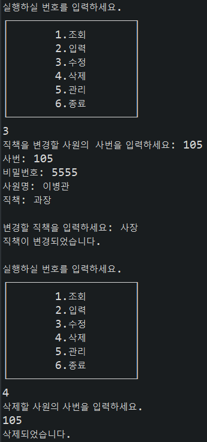

# GallerySys

## Description

JAVA Console로 구현한 갤러리 관리 시스템


* **실행화면 및 조회 예시**


  
* **수정 및 삭제 기능 예시**


  

---

## Getting Started

DB Table 생성 후 실행 (`Java console`로 실행)

```sql
create table emp_tbl(
emp_id number primary key,
pwd varchar2(20),
emp_name VARCHAR2(20),
position varchar2(20)
);

create table pic_tbl(
pic_name varchar2(20),
pic_num number primary key,
pic_f varchar2(20),
qty number);

create table manage(
num number primary key,
emp_id number,
pic_num number);

alter table manage add constraint emp_fk foreign key (emp_id) REFERENCES emp_tbl(emp_id)ON DELETE CASCADE;
alter table manage add constraint pic_fk foreign key (pic_num) REFERENCES pic_tbl(pic_num) ON DELETE CASCADE;

CREATE SEQUENCE SEQ_MNG
START WITH 1
INCREMENT BY 1
MAXVALUE 100
nocycle;
```